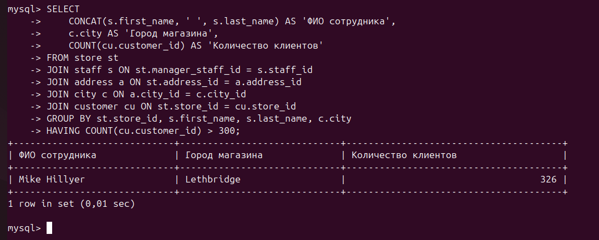
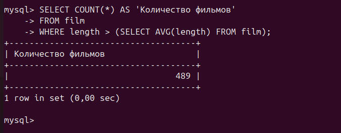
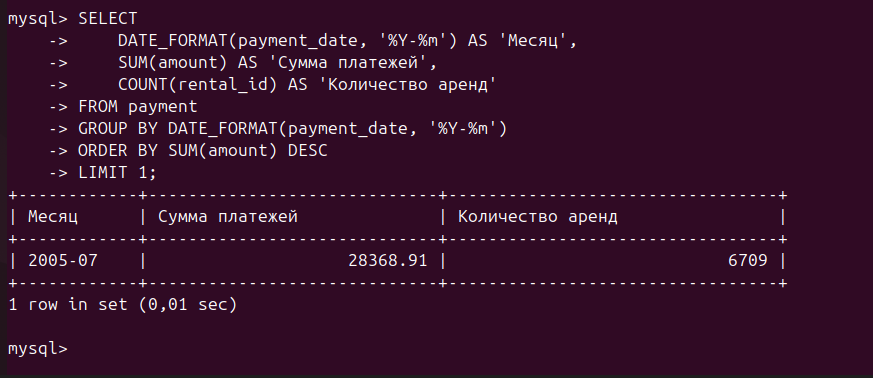
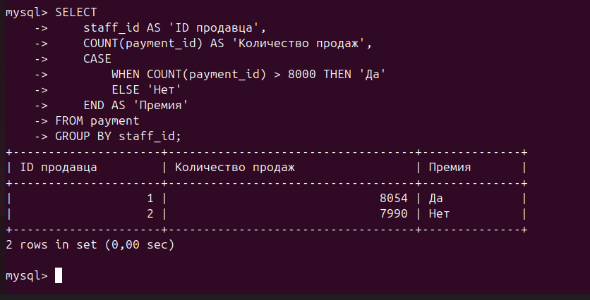
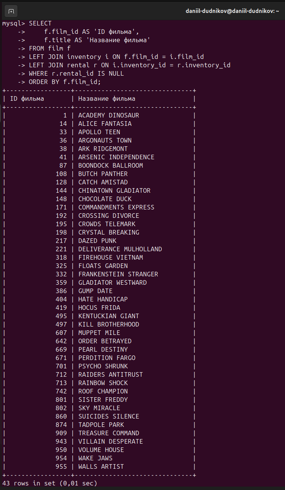

# Домашнее задание к занятию «SQL. Часть 2»
**Выполнил:** Даниил Дудников

## Задание 1: Магазин с более чем 300 покупателями
**Описание:** Поиск магазина с максимальным количеством закреплённых клиентов.

## Задание 2: Фильмы длиннее среднего  
**Описание:** Подсчёт фильмов с продолжительностью выше средней.

## Задание 3: Месяц с наибольшей суммой платежей
**Описание:** Определение наиболее прибыльного месяца и количества аренд.

## Задание 4*: Продавцы и премии
**Описание:** Анализ продаж сотрудников и определение права на премию.

## Задание 5*: Фильмы не в аренде
**Описание:** Выявление фильмов, которые никогда не арендовались.

